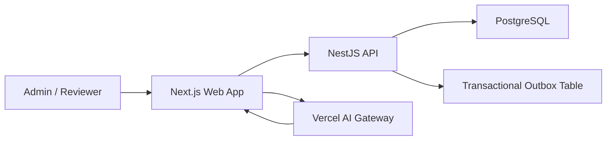
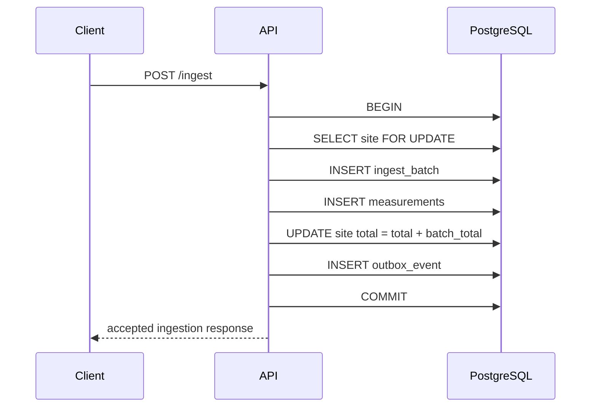
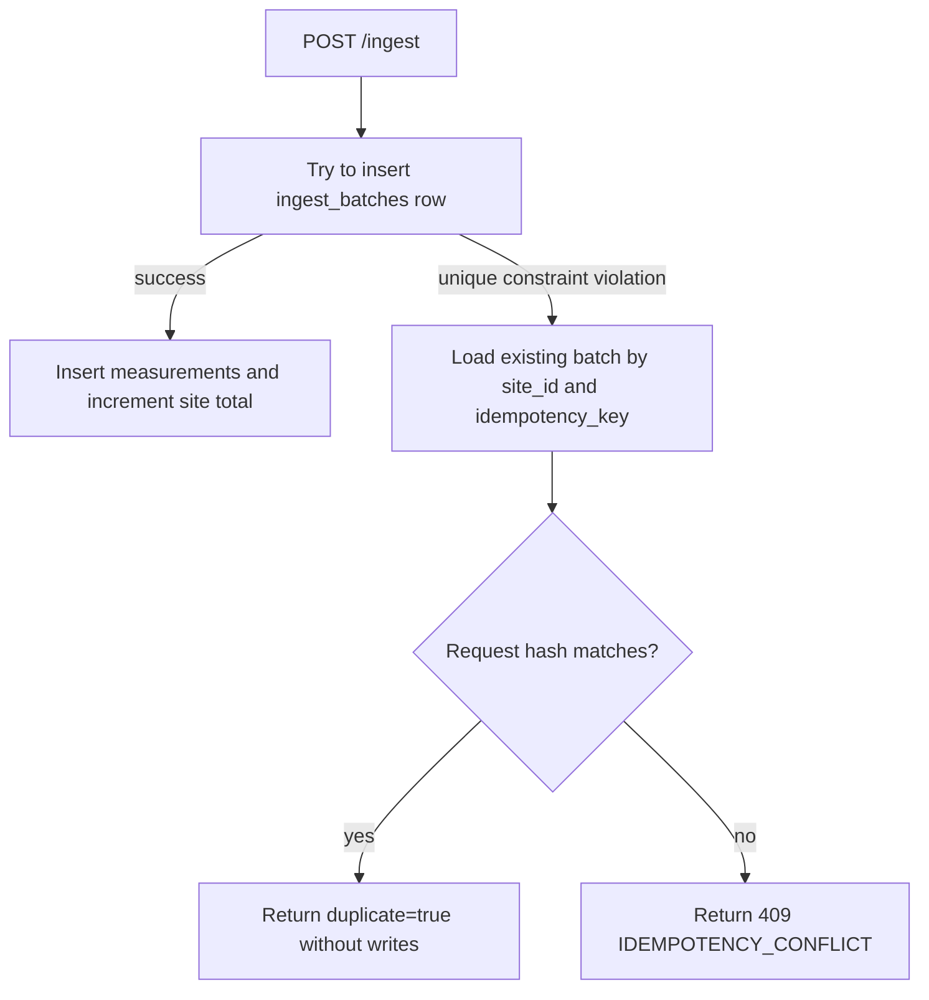

# Architecture

This repository implements a full-stack methane emissions monitoring platform for industrial sites. The primary architectural problem is not CRUD. The hard part is accepting measurement batches from unreliable field clients while preserving data integrity under retries, concurrent writes, and partial failures.

The solution is a modular full-stack application:

- Frontend: Next.js App Router, React, TypeScript, shadcn/ui, TanStack Query, Zod, AI SDK, AI Elements
- Backend: NestJS, TypeScript, Prisma, Zod
- Database: PostgreSQL
- Local infrastructure: Docker Compose for Postgres, Redis, and optional pgAdmin

The system is intentionally designed as a modular monolith rather than a distributed system. That is the right default for this take-home because the core correctness guarantees live in one transactional database boundary. The architecture still leaves explicit seams for future workers, queues, alerting, and additional teams.

## Design Goals

1. Preserve ingestion correctness under real-world field retries.
2. Prevent duplicate raw measurements and double-counted site totals.
3. Make the critical write path transactional and easy to reason about.
4. Keep modules small enough that another engineer can safely extend them.
5. Expose consistent validation, response, and error behavior across endpoints.
6. Keep the frontend backed by live API data rather than mock dashboard state.
7. Document trade-offs clearly instead of hiding complexity behind generic abstractions.

## System Overview



The web app owns user interaction, dashboard composition, AI streaming, and typed frontend contracts. The NestJS API owns domain workflows, validation, transactions, idempotency, and durable persistence. PostgreSQL is the source of truth for sites, measurements, ingestion batches, outbox events, and chat sessions.

## Repository Structure

```text
apps/
  api-server/
    prisma/
      schema.prisma
      migrations/
    src/
      modules/
        sites/
        ingestion/
        outbox/
        chat/
      shared/
        database/
        errors/
        responses/
        transactions/
        validation/

  web-app/
    app/
      dashboard/
      chat/
      simulation/
      api/chat/
    components/
      layout/
      ui/
      ai-elements/
    features/
      dashboard/
      sites/
      ingestion/
      chat/
      simulation/
    lib/
      api/
      config/
      format/
```

The most important structural choice is feature ownership. Backend modules own backend use cases. Frontend feature folders own UI, API client contracts, hooks, and view models for their domain. Shared code is kept small and boring.

## Backend

### Backend Pattern

The backend is a modular NestJS monolith using:

- Controllers as transport adapters.
- Zod validation pipes for request boundaries.
- Services as small module-facing APIs.
- Commands as normalized use-case input objects.
- Processors for multi-step business workflows.
- Repositories for persistence operations.
- A transaction manager for explicit transactional boundaries.

The ingestion flow is the clearest example:

```text
POST /ingest
  -> IngestController
  -> ZodValidationPipe
  -> IngestionService
  -> IngestMeasurementsCommand
  -> IngestMeasurementsProcessor
  -> Repositories
  -> Prisma transaction
  -> PostgreSQL
```

This is a Command/Processor pattern. The command turns the HTTP request into a normalized immutable application input. It also computes the canonical request hash used for idempotency. The processor owns the orchestration of the critical write workflow.

This split keeps controllers thin and avoids placing transaction logic in a service that also has to know about HTTP concerns. Another engineer can test the ingestion processor directly without booting Nest or making HTTP calls.

### Module Responsibilities

#### `sites`

Owns monitored industrial assets:

- `POST /sites`
- `GET /sites`
- `GET /sites/:id/metrics`
- `GET /sites/:id/emissions-trend`

The sites module owns site creation, compliance computation, metrics reads, and per-site trend analytics.

#### `ingestion`

Owns reliable batch ingestion:

- `POST /ingest`
- command construction
- request hashing
- atomic write orchestration
- duplicate retry handling

The ingestion module is intentionally isolated because it contains the most important correctness logic.

#### `outbox`

Owns transactional event persistence:

- writes `measurement.batch_ingested` events in the same transaction as ingestion
- exposes a worker seam for future alerting, analytics, notifications, or integrations

The worker is stubbed because no real downstream transport has been selected. The outbox table is still valuable because it proves the write model can support reliable asynchronous processing without coupling alert delivery to the request path.

#### `chat`

Owns durable operations chat persistence:

- chat sessions
- chat messages
- ordered AI SDK message parts

Chat persistence lives behind the backend API instead of the Next.js filesystem. That matters for Vercel deployment because serverless filesystems are not durable application storage.

### Unified API Boundary

All successful responses are wrapped by the global response interceptor:

```json
{
  "success": true,
  "data": {},
  "meta": {
    "request_id": "...",
    "timestamp": "..."
  }
}
```

All errors are normalized by the global exception filter:

```json
{
  "success": false,
  "error": {
    "code": "VALIDATION_FAILED",
    "message": "Request validation failed.",
    "details": {}
  },
  "meta": {
    "request_id": "...",
    "timestamp": "..."
  }
}
```

This is a platform decision. If multiple teams were consuming or contributing to the API, they would get a stable response envelope, request id propagation, predictable timestamps, and typed application error codes.

### Validation Strategy

Request validation happens at the edge of each controller using Zod schemas.

Examples:

- `POST /sites` requires a name and positive `emission_limit`; `metadata` is accepted and defaults to an empty object so every persisted site has metadata.
- `POST /ingest` requires a UUID `site_id`, idempotency key length constraints, and 1 to 100 readings.
- Each reading requires `source_id`, ISO-8601 `measured_at`, positive `methane_kg`, and optional metadata.

The API accepts snake_case payloads because that is the external contract. Internally, commands and frontend view models can use camelCase. This keeps the transport format explicit instead of leaking database or frontend naming conventions across the entire system.

## Backend Hard Parts

### Atomic Ingestion Transaction

`POST /ingest` performs the critical workflow in one Prisma transaction:

1. Lock the target site row with `SELECT ... FOR UPDATE`.
2. Create an `ingest_batches` row keyed by `(site_id, idempotency_key)`.
3. Insert all raw measurement rows.
4. Atomically increment `sites.total_emissions_to_date`.
5. Write a transactional outbox event.



If any step fails, the transaction rolls back. That means the system never commits only the raw measurements without the summary, or only the summary without the raw measurements.

### Concurrency Control

The system uses pessimistic row-level locking for concurrent ingestion into the same site:

```sql
SELECT id
FROM sites
WHERE id = $1
FOR UPDATE
```

This lock is acquired inside the transaction before creating the batch, inserting measurements, incrementing the site total, or writing the outbox event.

If 10 sources ingest readings for the same `site_id` at the same time, PostgreSQL serializes those transactions on the one site row. Requests for different sites can still proceed independently because they lock different rows.

Pessimistic locking is the right trade-off here because the critical section is short and write-heavy. The alternative would be optimistic locking with a version column and retry loop. That is a good pattern when conflicts are rare and callers can tolerate retries. In this domain, conflicts against the same site are plausible, and field clients already operate in unreliable network conditions. Blocking briefly inside the database is simpler, more deterministic, and easier for API consumers to reason about.

The implementation also uses Prisma's atomic increment:

```ts
totalEmissionsToDate: {
  increment: amount,
}
```

The row lock serializes competing writers. The atomic increment protects against lost updates. Together, they make the denormalized total safe under concurrent writes.

### Retry Safety And Idempotency

Field devices may timeout after sending a request. They need to retry without creating duplicate measurements or double-counting emissions.

The backend handles that with a database unique constraint:

```text
UNIQUE(site_id, idempotency_key)
```

The ingestion command also computes a canonical request hash from:

- site id
- readings
- source ids
- measurement timestamps
- methane kg values
- reading metadata

The idempotency behavior is:

1. First request with a new key creates the batch, measurements, summary increment, and outbox event.
2. Retry with the same key and same canonical payload returns the existing batch response with `duplicate: true`.
3. Retry with the same key and different payload returns `409 IDEMPOTENCY_CONFLICT`.



This is enforced in PostgreSQL, not process memory. It remains safe across server restarts, multiple API instances, and Vercel/serverless scaling.

### Failure Handling

Important failure cases:

- Invalid request shape: rejected by Zod and returned as `VALIDATION_FAILED`.
- Missing site: rejected before any ingestion records are written.
- Duplicate retry with identical payload: returns existing batch without extra writes.
- Duplicate retry with different payload: returns `IDEMPOTENCY_CONFLICT`.
- Database failure mid-ingestion: the transaction rolls back.
- Unhandled exception: logged by the exception filter and returned as a normalized `INTERNAL_SERVER_ERROR`.

The write model is intentionally database-first. This avoids relying on best-effort application cleanup after failure.

## Frontend

### Frontend Pattern

The frontend is a feature-first Next.js App Router application.

Routes stay thin:

```text
app/dashboard/page.tsx
  -> features/dashboard/components/dashboard-page.tsx

app/chat/page.tsx
  -> features/chat/components/chat-page.tsx

app/simulation/page.tsx
  -> features/simulation/components/concurrency-simulation-page.tsx
```

Feature modules own their domain-specific UI, API contracts, hooks, and types:

```text
features/
  dashboard/
  sites/
  ingestion/
  chat/
  simulation/
```

Reusable UI primitives live under `components/ui` and are shadcn/ui components owned by the repo. Layout shell components live under `components/layout`. This keeps design primitives separate from business-specific workflows.

### Server State

The frontend uses TanStack Query for interactive server state.

```text
Client component
  -> feature query or mutation hook
  -> feature API function
  -> shared API client
  -> NestJS API
```

The shared API client:

- reads `NEXT_PUBLIC_API_BASE_URL`
- calls the backend
- unwraps the unified API success envelope
- throws typed request or contract errors
- validates response payloads with Zod when a schema is provided

This gives the frontend a strict contract at the network boundary. Components receive normalized camelCase view models instead of raw transport payloads.

### Dashboard Composition

The dashboard is live API-backed, not mock-data-backed. It includes:

- site summary cards
- monitored sites table
- per-site emissions trend chart
- site metrics panel
- create-site form
- manual ingestion form

The emissions trend chart calls `GET /sites/:id/emissions-trend` and owns a site selector so the chart always represents one explicit asset. The metrics panel calls `GET /sites/:id/metrics`. Create-site and ingestion mutations invalidate the relevant site queries so totals, metrics, and trends refresh from persisted data.

### Manual Ingestion UX

The manual ingestion form intentionally separates editable form state from the last submitted batch.

That matters for idempotency. When an operator clicks "Retry Last Batch", the frontend resends the exact same retained payload and idempotency key. It does not rebuild a new request from whatever happens to be in the form at that moment.

This mirrors the field-device retry contract:

```text
retry same batch -> same idempotency key + same payload
```

The UI surfaces duplicate-safe retries as operator feedback, but the backend remains the source of truth for totals and persisted records.

### Simulation Harness

The `/simulation` route is a reviewer-facing harness over the same production API clients used by the dashboard.

It:

1. Creates an isolated site.
2. Fires concurrent `POST /ingest` requests against that same site.
3. Reads `GET /sites/:id/metrics`.
4. Compares expected total vs persisted total.
5. Displays each source request and idempotency key.

This keeps the demo honest. The UI does not fake concurrency, patch totals locally, or bypass the backend. A passing simulation means the deployed frontend called the deployed backend, the backend used the real Prisma transaction, and PostgreSQL maintained the correct persisted total.

### Operations Chat

The operations chat is intentionally constrained.

The Next.js app owns AI streaming through the Vercel AI SDK and AI Gateway. Durable chat state is stored in Postgres through the backend `chat` module.

The assistant can render dashboard UI through a constrained `@json-render/react` catalog. It cannot emit arbitrary JSX or arbitrary React components. Allowed renderer entries include:

- `DashboardOverview`
- `SummaryCards`
- `SitesTable`
- `SiteTrend`
- `SiteMetrics`
- `CreateSiteForm`
- `ManualIngestionForm`
- small layout primitives such as `Stack`, `Surface`, `Text`, and `Notice`

These renderer entries adapt existing dashboard, site, and ingestion components. That means the chat UI reuses the same TanStack Query hooks, API contracts, Zod validation, loading states, and mutation behavior as the normal dashboard.

This is a platform-thinking decision. The AI can choose which approved UI surface to show, but it cannot bypass domain boundaries or invent unreviewed data mutations.

## Database

### Database Choice

PostgreSQL is used as the correctness boundary. The ingestion guarantees rely on features that belong in a relational database:

- transactions
- row-level locks
- unique constraints
- decimal precision
- indexes
- foreign keys

Redis is available in local infrastructure but is not required for the critical correctness path. Idempotency and concurrency are enforced in PostgreSQL because those guarantees must survive process restarts and multiple API instances.

### Core Tables

#### `sites`

Stores industrial assets and the current denormalized emissions summary.

Important columns:

- `id`
- `name`
- `emission_limit`
- `total_emissions_to_date`
- `metadata`
- timestamps

`total_emissions_to_date` is denormalized for fast metrics and dashboard reads. Measurements remain the auditable source records.

#### `measurements`

Stores raw methane readings.

Important columns:

- `site_id`
- `batch_id`
- `source_id`
- `measured_at`
- `methane_kg`
- `metadata`

Measurements are append-only facts created by ingestion batches.

#### `ingest_batches`

Stores ingestion attempts and idempotency metadata.

Important columns:

- `site_id`
- `idempotency_key`
- `request_hash`
- `readings_count`
- `emissions_total`

Important constraint:

```text
UNIQUE(site_id, idempotency_key)
```

This table is the durable retry boundary.

#### `outbox_events`

Stores domain events written in the same transaction as ingestion.

Important columns:

- `aggregate_type`
- `aggregate_id`
- `event_type`
- `payload`
- `status`
- `attempts`
- `next_attempt_at`
- `processed_at`

The current worker is intentionally stubbed. The table establishes a reliable handoff point for future asynchronous processing.

#### `chat_sessions` and `chat_messages`

Store durable operations chat history.

Chat messages preserve AI SDK UI message ids, roles, JSON parts, optional metadata, and stable ordering. This avoids local filesystem persistence and works in deployed environments.

### Decimal Precision

Emission limits, methane readings, batch totals, and site totals use `Decimal(18, 6)`.

This avoids floating point drift in persisted environmental measurements. The API converts decimals to numbers at the presentation boundary, but persistence uses decimal values.

### Indexes

Important indexes:

- `ingest_batches(site_id)`
- unique `ingest_batches(site_id, idempotency_key)`
- `measurements(site_id, measured_at)`
- `measurements(batch_id)`
- `outbox_events(status, created_at)`
- `chat_sessions(updated_at)`
- unique `chat_messages(session_id, message_id)`
- unique `chat_messages(session_id, position)`

These indexes support the core access patterns:

- finding idempotency records
- listing site measurements by time range
- counting batch measurements
- polling outbox events
- loading recent chat sessions

### Data Model Trade-Offs

#### Denormalized Site Total

The system stores `sites.total_emissions_to_date` instead of recomputing it for every metrics request.

Benefits:

- fast `GET /sites/:id/metrics`
- simple dashboard summary reads
- clear current compliance calculation

Cost:

- writes are more complex because raw measurements and summary must stay in sync

Mitigation:

- raw measurements and summary updates happen in one transaction
- concurrent writes are serialized with a site row lock
- summary updates use atomic increments
- raw measurements remain available for audit or recalculation

#### Trend Endpoint Uses Measurements

The trend endpoint reads from `measurements` instead of the denormalized site total. It calculates a pre-window baseline, then adds daily measurement totals.

This avoids mock chart data and keeps the graph tied to persisted source facts. It also means a 7-day trend can still show cumulative emissions accurately even if the site had measurements before the displayed window.

#### Compliance Status Is Computed

Compliance is not persisted. It is computed from:

```text
total_emissions_to_date <= emission_limit
```

Persisting compliance status would introduce another source of truth that could become stale if limits or totals changed. Computing it keeps reads deterministic.

## Data Integrity Under Stress

The key question is whether this solution truly prevents double-counting under stress.

The answer is yes, because correctness is enforced at the database boundary with three overlapping protections:

1. A transaction groups the batch row, measurement rows, site summary increment, and outbox event.
2. A unique constraint prevents two committed batches with the same `(site_id, idempotency_key)`.
3. A row-level site lock plus atomic increment serializes concurrent updates to the same denormalized site total.

### Scenario: Client Times Out And Retries

If the first request commits but the client never receives the response:

1. The retry sends the same `site_id`, `idempotency_key`, and payload.
2. The insert into `ingest_batches` hits the unique constraint.
3. The processor loads the existing batch.
4. The request hash matches.
5. The API returns `duplicate: true`.
6. No new measurements are inserted.
7. The site total is not incremented again.

### Scenario: Same Key With Different Payload

If a client accidentally reuses an idempotency key for different readings:

1. The insert into `ingest_batches` hits the unique constraint.
2. The processor loads the existing batch.
3. The request hash does not match.
4. The API returns `409 IDEMPOTENCY_CONFLICT`.
5. No new measurements are inserted.
6. The site total is not incremented.

### Scenario: 10 Concurrent Sources Update The Same Site

If 10 different field sources send unique batches for one site at the same time:

1. Each request starts a transaction.
2. Each request attempts to lock the same site row.
3. PostgreSQL allows one transaction to hold the lock at a time.
4. Each transaction inserts its batch and measurements.
5. Each transaction atomically increments the site total.
6. The final total equals the sum of all committed batches.

This is covered by the backend e2e test that sends 10 concurrent ingestion requests to one site and verifies:

- 10 successful ingestion responses
- 10 measurement records
- 10 ingest batch records
- final metrics total equals the expected sum

## Testing And Verification

The test strategy focuses on the correctness risks rather than only happy paths.

Backend unit tests cover:

- ingestion transaction orchestration
- duplicate retry without double-counting
- idempotency conflict for reused keys with different payloads
- missing site rejection before writes
- metrics compliance status
- emissions trend calculations

Backend e2e tests cover:

- site creation
- idempotent ingestion retry
- measurement and batch counts
- outbox event creation
- metrics response
- emissions trend response
- concurrent same-site ingestion
- chat persistence

Frontend build-time verification covers:

- TypeScript contracts
- ESLint
- production Next.js build

The `/simulation` page adds a manual reviewer-facing verification path for the most important concurrency behavior.


## Trade-Offs

### Modular Monolith Instead Of Microservices

A distributed architecture would add network boundaries, deployment complexity, and distributed consistency problems. The core challenge here is transactional correctness, so the API and database are kept close together.

The code is still modular enough for future extraction. Sites, ingestion, outbox, and chat have clear module boundaries.

### Pessimistic Locking Instead Of Optimistic Locking

Optimistic locking would require a version column and retry logic on conflicts. That is useful for low-conflict domains. In this ingestion path, many sources may legitimately update the same site at the same time.

Pessimistic locking keeps the conflict inside PostgreSQL and gives a deterministic result without asking unreliable field clients to understand version conflicts.

### Denormalized Total Instead Of Always Summing Measurements

Always summing measurements would simplify writes but make metrics reads slower as data grows. The platform needs fast operational metrics, so it stores a summary on `sites`.

The added write complexity is controlled with transactions, locks, and tests.

### Prisma With Targeted Raw SQL

Most persistence uses Prisma for type-safe data access. The one targeted raw SQL query is `SELECT ... FOR UPDATE` because row-level locking is a database-specific concurrency primitive.

This is intentional. Avoiding raw SQL entirely would weaken the concurrency strategy. Using raw SQL everywhere would reduce maintainability. The compromise is to keep raw SQL narrow, explicit, and isolated in the repository method that owns site locking.

### Transactional Outbox Without A Full Worker

The outbox table is implemented, but the worker is a stub until a real downstream transport is selected.

This is preferable to pretending alerts are delivered reliably inline. The architecture records the event durably in the ingestion transaction and leaves a clear production extension point.

### AI Renderer Is Constrained

The chat assistant can render approved dashboard components, not arbitrary UI. This reduces novelty but protects maintainability and correctness. The AI cannot bypass frontend domain modules or backend API contracts.

## Known Limits And Next Hardening Steps

This implementation focuses on the stated take-home requirements and the data-integrity risks around ingestion. For a production rollout, the next areas I would harden are:

- Authentication and authorization for admin actions, ingestion clients, and chat tools.
- Device identity and per-device idempotency key policy so field clients cannot accidentally share key namespaces.
- Outbox worker implementation with retry backoff, dead-letter handling, and observability.
- Pagination or archival strategy for high-volume measurement history.
- Structured request logging and metrics around ingestion latency, lock wait time, duplicate retries, and idempotency conflicts.
- API rate limits and payload-size limits at the edge.
- Frontend integration tests for the dashboard ingestion and simulation flows.

These are intentionally separate from the core correctness path. The current implementation first proves that measurement ingestion, retries, and concurrent same-site updates are transactionally safe.

## Deployment Notes

The app is deployment-friendly for Vercel:

- The web app can deploy as a Next.js project.
- The API server can deploy separately with `DATABASE_URL` or `DATABASE_URL_UNPOOLED`.
- PostgreSQL should be provided by a durable hosted provider such as Neon.
- Chat persistence is in Postgres, not local disk.
- Frontend API calls use `NEXT_PUBLIC_API_BASE_URL`.

For production migrations, the backend build path should run:

```bash
pnpm prisma:migrate:deploy
pnpm build
```

## Engineering Maturity Summary

### How The Hard Parts Are Handled

Concurrency is handled with PostgreSQL row-level locking and atomic increments.

Atomicity is handled with a single Prisma transaction around the entire ingestion write path.

Failures are handled with rollback semantics, durable idempotency records, request hashing, structured errors, and a transactional outbox seam.

### Why The Code Is Modular

The backend separates transport, validation, application workflow, and persistence. The frontend separates route composition, feature modules, typed API clients, and reusable UI primitives.

This gives future engineers clear places to add behavior:

- new API workflow: add a module/service/processor/repository
- new dashboard view: add a feature component and query hook
- new event consumer: extend the outbox worker
- new chat-rendered UI: add a renderer catalog entry backed by an existing feature component

### Why Double-Counting Is Prevented

Double-counting is prevented by durable database constraints and transaction boundaries, not by best-effort frontend checks or in-memory state.

The critical guarantee is:

```text
same site_id + same idempotency_key + same payload
  -> one committed batch
  -> one set of measurements
  -> one site total increment
```

That guarantee remains true under retries, server restarts, and concurrent API instances because PostgreSQL enforces the uniqueness and transaction isolation at the source of truth.
